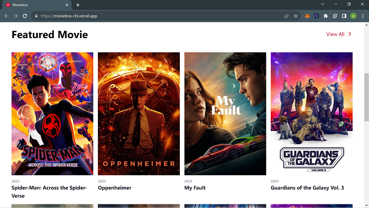
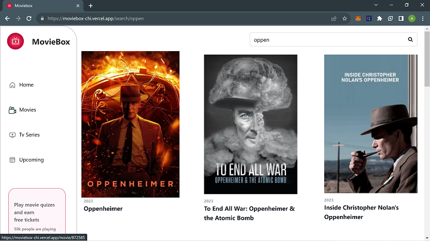
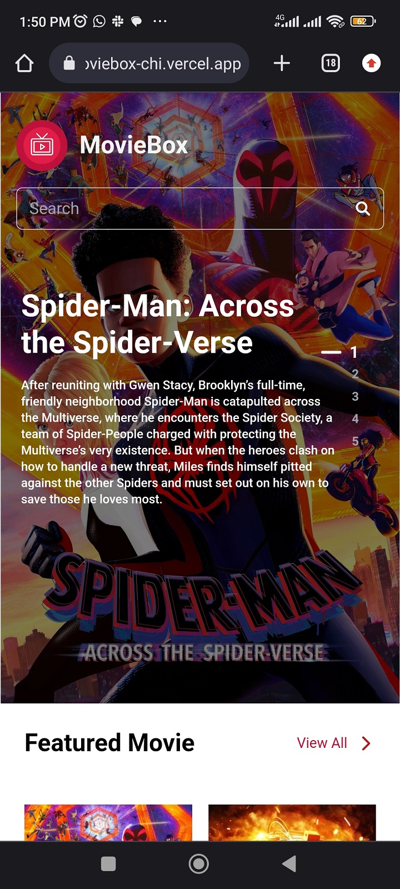

# Moviebox

This is a movie discovery web application that allows users to search for movies and view details about them. 

## Table of contents

- [Overview](#overview)
  - [The challenge](#the-challenge)
  - [Screenshot](#screenshot)
  - [Links](#links)
- [My process](#my-process)
  - [Built with](#built-with)
- [Author](#author)

## Overview

### The challenge

- Implement the [figma design](https://www.figma.com/file/tVfgoNfhYkQaUkh8LGqRab/MovieBox-(Community)?type=design&node-id=1220-324&mode=design&t=6998DWtjQrxz8mOf-0)
- Use data from [provided endpoint](https://www.themoviedb.org/)

### Screenshot


###

###



### Links

- Live Site URL: (https://moviebox-chi.vercel.app/)

## My process

### Built with

- TypeScript
- [React](https://reactjs.org/)
- [Tailwind](https://tailwindcss.com/)
- [Vite](https://vitejs.dev/)
- [React Query](https://tanstack.com/query/latest)


## Install

```
yarn install
```

## Setup your Environment Variables

```
1) change this file name .env.example to .env
2) open .env and paste your TMDB api url and API key here :  
VITE_API_KEY="tmdb api key"
VITE_BASE_URL="tmdb url"
```

## Getting Started

Then, run the development server:

```
yarn dev
```

Open [http://localhost:5173](http://localhost:5173) with your browser to see the result.

You can start editing the page by modifying `src/App.tsx`. The page auto-updates as you edit the file.

## Author

- Twitter - [@andemosa](https://www.twitter.com/andemosa)